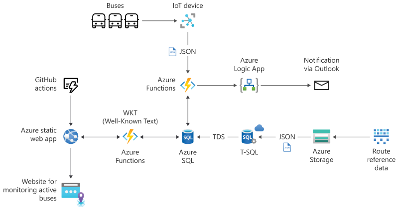

# Build serverless, full stack applications in Azure

Learn how to create, build, and deploy modern full stack applications in Azure leveraging the language of your choice (Python, Node.js, or .NET) and with a simple JQuery frontend. Topics covered include modern database capabilities, CI/CD and DevOps, backend API development, REST, and more. Using a real-world scenario of trying to catch the bus, you will learn how to build a solution that leverages Azure SQL Database, Azure Functions, Azure Static Web Apps, Logic Apps, Visual Studio Code and GitHub Actions.

## Features

This project features the following capabilities.

- azure-sql-database
- github-actions
- vs-code
- azure-functions
- azure-logic-apps
- azure-app-service-static
- azure-web-apps

## Architecture

## Related content

- [Architect modern applications using Azure SQL Database](https://learn.microsoft.com/training/modules/create-foundation-modern-apps/)
- [Modern development: creating a REST API, via CI/CD and back](https://devblogs.microsoft.com/azure-sql/modern-development-creating-a-rest-api-via-ci-cd-and-back/)
- [Video: Using Azure Pipelines for Azure SQL deployments](https://www.youtube.com/watch?v=G7H6HbzwAfs&list=PLlrxD0HtieHieV7Jls72yFPSKyGqycbZR&index=26)
- [10 reasons to use Azure SQL in your next project](https://devblogs.microsoft.com/azure-sql/10-reasons-to-use-azure-sql-in-your-next-project/).
- [Azure SQL JSON support sample](https://github.com/yorek/azure-sql-db-samples/tree/master/samples/03-json)
- [Geospatial support](/sql/relational-databases/spatial/spatial-data-sql-server)
- [OpenLayers library](https://openlayers.org/)
- [Graph models](/sql/relational-databases/graphs/sql-graph-overview)
- [Columnstore indexes](/sql/relational-databases/indexes/columnstore-indexes-overview)
- [Introduction to Memory-Optimized Tables](/sql/relational-databases/in-memory-oltp/introduction-to-memory-optimized-tables)
